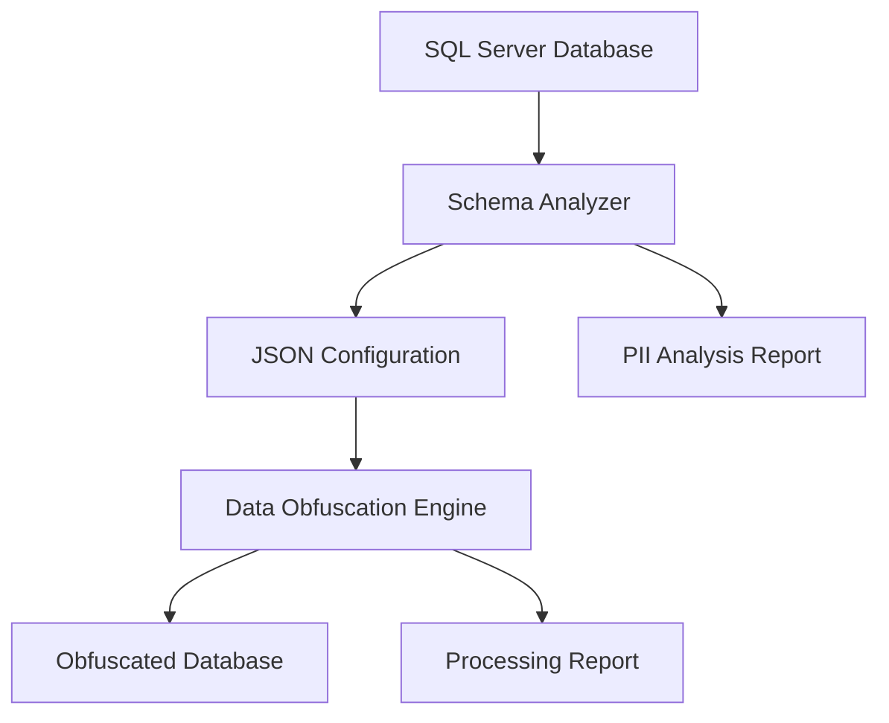

# Data Obfuscation Solution

A comprehensive .NET 8 solution for automated database schema analysis and intelligent data obfuscation, specifically designed for handling Personally Identifiable Information (PII) in SQL Server databases.

## 🎯 Solution Overview

This solution consists of two complementary tools that work together to provide end-to-end data obfuscation capabilities:

1. **Schema Analyzer** - Automatically discovers PII columns in databases
2. **Data Obfuscation Engine** - Obfuscates discovered PII with realistic replacement data



## 📁 Project Structure

```
treat-sql-db/
├── 📄 JSON/                          # Generated configuration files
├── 📋 Project-Docs/                  # Requirements and analysis documentation
├── 🔍 schema-analyzer/               # Automatic PII discovery tool
│   ├── Core/                         # Configuration generation logic
│   ├── Models/                       # Data models and schemas
│   ├── Services/                     # Schema analysis and PII detection
│   └── Program.cs                    # Main application
├── 🚀 data-obfuscation/              # Data obfuscation engine
│   ├── Configuration/                # JSON config parsing and validation
│   ├── Core/                         # Obfuscation engine and progress tracking
│   ├── Data/                         # Australian data providers and SQL repository
│   ├── Examples/                     # Usage examples and scenarios
│   └── configs/                      # Sample configuration files
└── 📝 README.md                      # This file
```

---

# 🔍 Schema Analyzer

**Automatically discovers PII columns and generates obfuscation configurations**

## Features

- **🔍 Intelligent PII Detection**: Pattern-based analysis with confidence scoring
- **🧠 Machine Learning Heuristics**: Context-aware column classification
- **📊 Comprehensive Reporting**: Detailed analysis summaries with statistics
- **⚙️ Auto-Configuration**: Ready-to-use JSON configurations for obfuscation
- **🔗 Relationship Discovery**: Automatic referential integrity detection

## Supported PII Types

| PII Category | Data Types | Examples |
|--------------|------------|----------|
| **Personal Names** | FirstName, LastName, FullName | John Smith, Mary Johnson |
| **Contact Info** | Email, Phone, Mobile | john@company.com, 0412 345 678 |
| **Addresses** | Street, City, Postal Code | 123 Main St, Melbourne VIC 3000 |
| **Business IDs** | ABN, ACN, Tax Numbers | 12 345 678 901 |
| **Licenses** | Driver License, Permits | NSW-12345678 |
| **Technical** | IP Addresses, URLs | 192.168.1.1, https://example.com |
| **Free Text** | Comments, Notes, Descriptions | Potential PII in text fields |

## Quick Start

### Prerequisites
- .NET 8.0 SDK
- SQL Server access
- AdventureWorks2019 database (for demo)

### Usage
```bash
cd schema-analyzer
dotnet build
dotnet run
```

### Configuration
Pre-configured for:
- **Server**: localhost
- **Database**: AdventureWorks2019  
- **Authentication**: SQL Server (sa/Count123#)
- **Output**: ../JSON/AdventureWorks2019.json

### Expected Output
```
[INFO] Starting Schema Analysis for database: AdventureWorks2019
[INFO] Found 71 tables with 503 columns total
[INFO] Identified 12 tables with PII data containing 47 PII columns
[INFO] Obfuscation configuration saved to: ../JSON/AdventureWorks2019.json
[INFO] Analysis summary saved to: ../JSON/AdventureWorks2019_analysis_summary.json
```

## Detection Algorithm

### Confidence Scoring
```
Column Name Match:     +0.8 confidence
Data Type Match:       +0.3 confidence  
Table Context:         +0.2 confidence
Length Validation:     +0.1 confidence
Contextual Heuristics: +0.3 confidence
─────────────────────────────────────
Minimum Threshold:     0.6 for PII detection
```

### Pattern Examples
```javascript
Person Names:    *name*, *first*, *last*, *middle*, *full*
Email Addresses: *email*, *mail*, *e_mail*, *contact*email*
Phone Numbers:   *phone*, *mobile*, *cell*, *tel*, *fax*
Addresses:       *address*, *street*, *city*, *suburb*, *postal*
```

---

# 🚀 Data Obfuscation Engine

**High-performance, deterministic data obfuscation with Australian fleet industry data**

## Features

- **🇦🇺 Australian Data**: Realistic fleet industry data (drivers, vehicles, operators)
- **🔄 Deterministic**: Same input always produces same output (SHA-256 seeding)
- **⚡ High Performance**: 100,000+ rows/minute with parallel processing
- **🔗 Referential Integrity**: Maintains relationships across tables
- **📋 External Configuration**: Complete JSON-based control
- **📊 Progress Tracking**: Real-time monitoring and reporting

## Australian Fleet Data Types

| Data Type | Description | Example Output |
|-----------|-------------|----------------|
| **DriverName** | Australian names with diversity | Sarah Thompson, Michael Chen |
| **DriverLicenseNumber** | State-specific formats | NSW-12345678, VIC-87654321 |
| **ContactEmail** | Fleet industry domains | john.smith@transport.com.au |
| **DriverPhone** | Australian mobile format | 0412 345 678 |
| **VehicleRegistration** | State-specific plates | ABC123 (NSW), 123ABC (VIC) |
| **VINNumber** | 17-character vehicle ID | 1HGBH41JXMN109186 |
| **VehicleMakeModel** | Australian fleet vehicles | Toyota Hiace, Ford Transit |
| **OperatorName** | Transport companies | Reliable Transport, City Logistics |
| **BusinessABN** | Australian Business Number | 12 345 678 901 |
| **Address** | Commercial addresses | 123 Transport Way, Sydney NSW 2000 |
| **GPSCoordinate** | Australian coordinates | -33.865143,151.209900 |
| **RouteCode** | Route identifiers | SYD-MEL-001, R-042 |

## Quick Start

### Build and Run
```bash
cd data-obfuscation
dotnet build

# Validate configuration
dotnet run configs/test-config.json --validate-only

# Test run (no data changes)
dotnet run configs/test-config.json --dry-run

# Production obfuscation
dotnet run configs/production-config.json
```

### Sample Configuration
```json
{
  "global": {
    "connectionString": "Server=localhost;Database=FleetDB;Trusted_Connection=true;",
    "globalSeed": "FleetSeed2024",
    "batchSize": 15000,
    "parallelThreads": 8,
    "dryRun": false
  },
  "tables": [
    {
      "tableName": "Drivers",
      "priority": 1,
      "primaryKey": ["DriverID"],
      "columns": [
        {
          "columnName": "DriverName",
          "dataType": "DriverName",
          "enabled": true,
          "fallback": {
            "onError": "useDefault",
            "defaultValue": "REDACTED_DRIVER"
          }
        }
      ]
    }
  ]
}
```

## Performance Optimization

| Database Size | Processing Time | Throughput | Resource Usage |
|---------------|----------------|------------|----------------|
| 100GB | 1-3 hours | 150K rows/min | 4-8GB RAM |
| 500GB | 4-12 hours | 200K rows/min | 8-16GB RAM |
| 1TB+ | 8-24 hours | 250K rows/min | 16-32GB RAM |

### Optimization Settings
```json
{
  "global": {
    "batchSize": 25000,           // Larger batches for better throughput
    "parallelThreads": 16,        // Use all CPU cores
    "maxCacheSize": 5000000,      // Large cache for better performance
    "enableValueCaching": true    // Essential for deterministic performance
  }
}
```

---

# 🔄 End-to-End Workflow

## Complete Process

### 1. **Schema Analysis**
```bash
cd schema-analyzer
dotnet run
```
**Output**: `JSON/AdventureWorks2019.json` + analysis report

### 2. **Configuration Review**
- Review generated configuration
- Customize data types if needed
- Adjust batch sizes and priorities
- Set dry-run mode for testing

### 3. **Test Obfuscation**
```bash
cd data-obfuscation
dotnet run ../JSON/AdventureWorks2019.json --dry-run
```

### 4. **Production Obfuscation**
```bash
# Backup database first
sqlcmd -S server -Q "BACKUP DATABASE MyDB TO DISK='backup.bak'"

# Run obfuscation
dotnet run ../JSON/AdventureWorks2019.json
```

## Example Output Flow

### Schema Analysis Results
```json
{
  "databaseName": "AdventureWorks2019",
  "totalTables": 71,
  "totalColumns": 503,
  "tablesWithPII": 12,
  "piiColumns": 47,
  "piiColumnsByType": {
    "DriverName": 15,
    "ContactEmail": 8,
    "DriverPhone": 6,
    "Address": 12
  }
}
```

### Generated Configuration
```json
{
  "metadata": {
    "description": "Auto-generated obfuscation configuration for AdventureWorks2019",
    "createdBy": "SchemaAnalyzer"
  },
  "global": {
    "globalSeed": "AdventureWorks2019Seed20240713",
    "batchSize": 15000,
    "dryRun": true
  },
  "tables": [
    {
      "tableName": "Person",
      "priority": 1,
      "columns": [
        {
          "columnName": "FirstName",
          "dataType": "DriverName",
          "enabled": true
        }
      ]
    }
  ]
}
```

### Obfuscation Results
```
[INFO] Starting data obfuscation process
[INFO] Processing table: Person.Person
[INFO] Table Person.Person: 19,972/19,972 (100.0%) - 1,331 rows/sec
[INFO] Completed table Person.Person: 19,972 rows in 00:00:15
[INFO] Overall progress: 12/12 tables (100.0%) - 12 completed, 0 failed
[INFO] Tables processed: 12, Rows processed: 84,315
[INFO] Duration: 00:01:23
```

---

# 🛠️ Configuration Options

## Schema Analyzer Configuration

### Custom Connection String
```csharp
// In Program.cs
var connectionString = "Server=your-server;Database=your-db;User Id=user;Password=pass;";
```

### Custom PII Detection Rules
```csharp
// In PIIDetectionService.cs
new PIIDetectionRule
{
    DataType = PIIDataType.Custom,
    ObfuscationDataType = "CustomDataType",
    ColumnNamePatterns = new List<string> { "*custom*", "*pattern*" },
    BaseConfidence = 0.8
}
```

## Data Obfuscation Configuration

### Environment-Specific Configs
```bash
configs/
├── development-config.json    # Limited rows, dry-run enabled
├── staging-config.json       # Subset processing
├── production-config.json    # Full production settings
└── emergency-config.json     # Critical data only
```

### Custom Data Types
```json
{
  "dataTypes": {
    "ExecutiveDriverName": {
      "baseType": "DriverName",
      "customSeed": "ExecutiveSeed2024",
      "preserveLength": true,
      "validation": {
        "minLength": 10,
        "maxLength": 50
      }
    }
  }
}
```

### Referential Integrity
```json
{
  "referentialIntegrity": {
    "enabled": true,
    "relationships": [
      {
        "name": "DriverConsistency",
        "primaryTable": "Drivers",
        "primaryColumn": "DriverName",
        "relatedMappings": [
          {"table": "VehicleAssignments", "column": "DriverName", "relationship": "exact"}
        ]
      }
    ]
  }
}
```

---

# 🔒 Security & Compliance

## Data Protection Features

- **🔐 Deterministic Generation**: SHA-256 seeding ensures consistency
- **🚫 No Hardcoded Values**: All mappings externalized to JSON
- **🔄 Reversible Process**: Mapping files enable data restoration if needed
- **👁️ Audit Trail**: Complete logging of all operations
- **🧪 Dry Run Mode**: Safe testing without data modification

## Best Practices

### Pre-Deployment
```bash
# 1. Always backup first
sqlcmd -S server -Q "BACKUP DATABASE MyDB TO DISK='backup.bak'"

# 2. Validate configuration
DataObfuscation.exe config.json --validate-only

# 3. Test with dry run
DataObfuscation.exe config.json --dry-run

# 4. Process in stages for large databases
DataObfuscation.exe stage1-config.json  # Non-critical tables
DataObfuscation.exe stage2-config.json  # Supporting tables  
DataObfuscation.exe stage3-config.json  # Core tables
```

### Monitoring
- Real-time progress tracking
- Performance metrics logging
- Error handling and recovery
- Resource usage monitoring

---

# 🚀 Deployment Guide

## System Requirements

### Minimum
- .NET 8.0 Runtime
- 4GB RAM
- 2 CPU cores
- SQL Server 2016+

### Recommended (1TB+ databases)
- 16+ CPU cores
- 32-64GB RAM
- NVMe SSD storage
- 10Gbps+ network
- SQL Server 2019+

## Docker Deployment

### Dockerfile
```dockerfile
FROM mcr.microsoft.com/dotnet/runtime:8.0
COPY data-obfuscation/bin/Release/net8.0/publish/ /app/
WORKDIR /app
ENTRYPOINT ["dotnet", "DataObfuscation.dll"]
```

### Usage
```bash
docker build -t data-obfuscation .
docker run -v $(pwd)/configs:/app/configs -v $(pwd)/JSON:/app/JSON data-obfuscation /app/JSON/config.json
```

## Production Scaling

### Multiple Servers
```
┌─────────────────┐    ┌──────────────────┐    ┌─────────────────┐
│  App Server 1   │    │  App Server 2    │    │   Database      │
│  (Tables 1-300) │◄──►│  (Tables 301-600)│◄──►│   Server        │
└─────────────────┘    └──────────────────┘    │                 │
                                               │  Optimized for  │
┌──────────────────┐                          │  High I/O       │
│  App Server 3    │                          │                 │
│  (Tables 601-900)│◄─────────────────────────►│                 │
└──────────────────┘                          └─────────────────┘
```

### Expected Performance
- **Single Server**: 8-24 hours for 1TB
- **3 Servers**: 3-8 hours for 1TB
- **Database Load**: 30-50% CPU, high I/O
- **Network Usage**: 50-200 Mbps sustained

---

# 📚 Troubleshooting

## Common Issues

### Build Issues
```bash
# Update packages if build fails
dotnet restore
dotnet clean
dotnet build
```

### Connection Issues
```
Error: Cannot connect to database
Solutions:
- Verify connection string format
- Check SQL Server authentication
- Ensure network connectivity
- Validate database exists
```

### Performance Issues
```json
{
  "solutions": [
    "Increase batchSize (5000-50000)",
    "Optimize parallelThreads (CPU cores)",
    "Enable maxCacheSize (1M-10M)",
    "Temporarily disable database indexes"
  ]
}
```

### Memory Issues
```json
{
  "solutions": [
    "Reduce maxCacheSize",
    "Lower parallelThreads", 
    "Use smaller customBatchSize",
    "Process tables sequentially"
  ]
}
```

## Getting Help

- **Documentation**: Check README files in each project
- **Examples**: Review configs/ and Examples/ directories
- **Logs**: Enable detailed logging for diagnostics
- **Issues**: Report problems with full error logs

---

# 📄 License

This project is licensed under the MIT License - see the [LICENSE](LICENSE) file for details.

---

# 🤝 Contributing

1. Fork the repository
2. Create feature branch (`git checkout -b feature/AmazingFeature`)
3. Commit changes (`git commit -m 'Add AmazingFeature'`)
4. Push to branch (`git push origin feature/AmazingFeature`)
5. Open Pull Request

---

# 📞 Support

For questions, issues, or feature requests:
- Create an issue in the repository
- Review the troubleshooting sections
- Check the example configurations
- Enable detailed logging for diagnostics

**Built with ❤️ for secure, compliant data obfuscation**